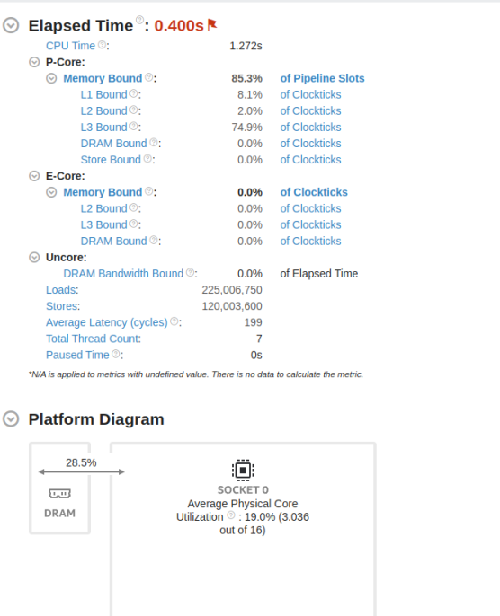
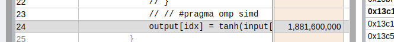
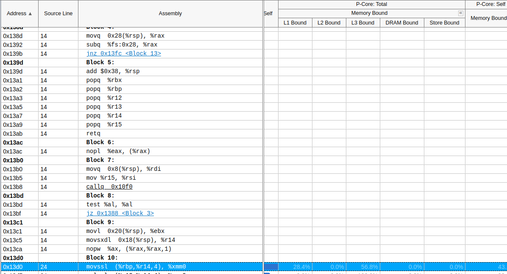
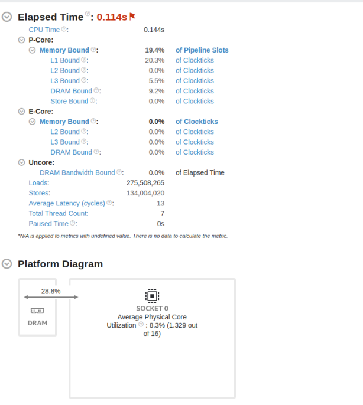
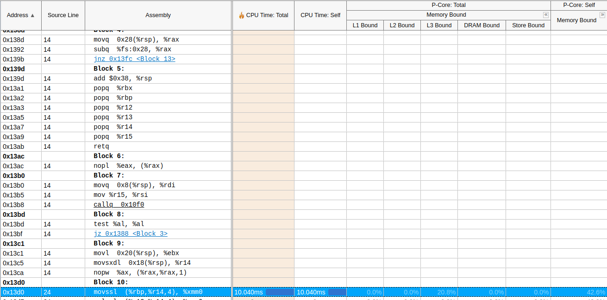

# Accelerating ML Inference in Python and C++
This project focuses on optimizing a feed-forward array multiplication process using a multithreading approach in C++. The implementation leverages 4 threads and employs dynamic scheduling to enhance computational efficiency, which is particularly beneficial in high-performance computing (HPC) applications.

## VTUNE Profiling

### Source to Optimize

We're focusing on a simple feed-forward array multiplication using 4 threads in C++. The initial implementation uses dynamic scheduling with a default chunk size of 1.

```cpp
// Original C++ Code
omp_set_num_threads(4);
#pragma omp parallel for schedule(dynamic)
for (int idx = 0; idx < N; ++idx) {
    output[idx] = tanh(input[idx] * weights[idx]);  // Example activation function
}
```

#### Compile the C++ File

```bash
g++ -g -o multsimd -O2 -fopenmp multsimd.cpp
```

### Setting Up VTUNE for Profiling

Initialize VTUNE for in-depth performance analysis:

```bash
vtune-backend --web-port=8080  # Use web-port in HPC environments
vtune-agent --user/--shared    # Start the VTUNE agent
```

Select `multsimd` as the application path and choose `memory access` for analysis.

### Initial VTUNE Summary

VTUNE's initial summary with the default dynamic scheduling (chunk size 1) indicated high L3 cache usage.



- **L3 Cache Bound:** Suggested potential L3 cache contention.
- **Detailed Analysis:** Narrowed down to a specific source line:



Deeper assembly-level analysis:



The instruction `movssl (%rbp,%r14,4), %xmm0` showed significant latency (143.9%).

| Address | Source Line | Assembly                         | CPU Time: Total | CPU Time: Self | L1 Bound | L2 Bound | L3 Bound | DRAM Bound | Store Bound | Memory Bound | Loads: Total | Loads: Self | Stores: Total | Stores: Self | Avg Latency (cycles): Total | Avg Latency (cycles): Self |
|---------|-------------|----------------------------------|-----------------|----------------|----------|----------|----------|------------|-------------|--------------|--------------|-------------|---------------|--------------|----------------------------|---------------------------|
| 0x13d0  | 24          | movssl (%rbp,%r14,4), %xmm0      | 428.715ms       | 428.715ms      | 6.7%     | 0.0%     | 88.2%    | 0.0%       | 0.0%        | 91.7%        | 10,000,300   | 0.0%        | 0             | 0.0%        | 143.9%                      | 287                       |

### Hypothesis and Testing with Adjusted Chunk Size

Assuming that each array index is close in memory, increasing the workload per thread might improve cache coherence and reduce context switching. The chunk size was increased to 60.

#### Revised Code with Larger Chunk Size

```cpp
// Revised C++ Code
omp_set_num_threads(4);
#pragma omp parallel for schedule(dynamic, 60)
for (int idx = 0; idx < N; ++idx) {
    output[idx] = tanh(input[idx] * weights[idx]);  // Example activation function
}
```

### Revised VTUNE Summary

Post-adjustment, VTUNE showed a reduction in memory and L3 cache bounds.



Further analysis of the same code block:



#### Table: Optimized Performance Metrics

| Address | Source Line | Assembly                    | CPU Time: Total | CPU Time: Self | L1 Bound | L2 Bound | L3 Bound | DRAM Bound | Store Bound | Memory Bound | Loads: Total | Loads: Self | Stores: Total | Stores: Self | Avg Latency (cycles): Total | Avg Latency (cycles): Self |
|---------|-------------|-----------------------------|-----------------|----------------|----------|----------|----------|------------|-------------|--------------|--------------|-------------|---------------|--------------|----------------------------|---------------------------|
| 0x13d0  | 24          | movssl (%rbp,%r14,4), %xmm0 | 10.040ms        | 10.040ms       | 0.0%     | 0.0%     | 20.8%    | 0.0%       | 0.0%        | 42.6%        | 11,000,330   | 0.0%        | 0             | 0.0%        | 0.0%                       | 0                        |
### Insights from Optimization

#### Impact on Cache Utilization
- Smaller chunk sizes in default dynamic scheduling led to frequent context switching and cache misses.
- Larger chunks improved cache locality, reducing cache misses.

#### Implications for movssl Instruction
- Enhanced performance due to better cache utilization.
- Fewer cache misses resulted in faster execution of the `movssl` instruction.

### Conclusion

Adjusting the chunk size in the parallel loop significantly improved cache utilization and reduced cache contention. This optimization showcases the impact of thread workload distribution on computational performance in parallelized environments.